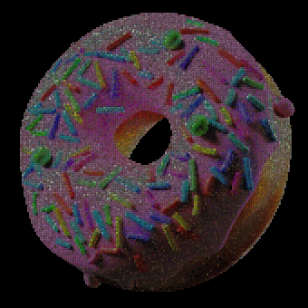

Welcome to the donut finder! Head over to <a href="https://andrewprice.art/17731-first-steps/donuts" target="_blank">Andrew Price's Donut Database</a> to find your donut number. Then enter your number below and the Finder will try to find your donut in the mosaic using image recognition! 

<html>
    <head>
        
        
        
        
        
        
        
        
        
        
        
        
    </head>
    <body>

        <label for="fdonut-id">Donut number:</label>
        <input type="number" id="fdonut-id" name="fdonut-id" min=1 max=17731 required>  
        <button type="button" id="submitBtn">Submit</button>

        <h3 id="name"></h3>
        <h4 id="country"></h4>
        <h5 id="donut-no"></h5>
        
        
        

            <canvas id="result"></canvas>
        

        

        
        

        

        
    </body>
    
</html>
*This page is fan made by donut contributor #4314 and is not affiliated with our favorite teacher of blender donut modelling Andrew Price. All images are sourced from [https://andrewprice.art/](https://andrewprice.art/).*
